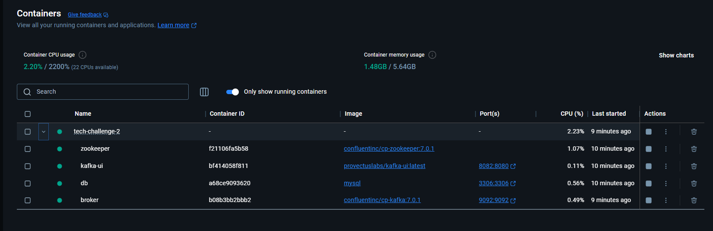
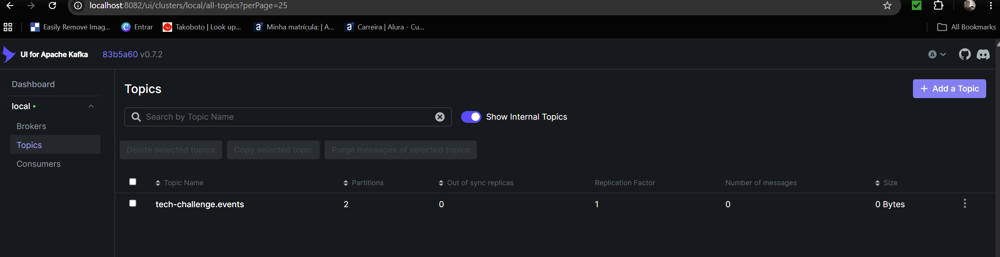

# tech-challenge-2

## Contexto do problema

A alfabetização na infância é um dos principais indicadores de desenvolvimento educacional. No contexto do **Compromisso Nacional Criança Alfabetizada**, o desafio é acompanhar a evolução da alfabetização no Brasil e comparar resultados com metas nacionais, estaduais e municipais.

O indicador utilizado no projeto é o **Indicador Criança Alfabetizada**, baseado no percentual de estudantes que atingem o nível mínimo de proficiência definido pelo INEP para serem considerados alfabetizados ao final do 2º ano do ensino fundamental.

Mais do que consultar um número isolado, o problema pede uma base integrada que permita responder perguntas como:

- quais municípios estão abaixo da meta;
- quais UFs evoluem melhor ao longo do tempo;
- onde existem desigualdades regionais;
- como preparar uma base confiável para análises estatísticas, dashboards e IA.

### Desafio educacional e uso do indicador

O desafio da fase é construir uma pipeline capaz de integrar diferentes entidades relacionadas à alfabetização:

- `uf`
- `municipio`
- `alunos`
- `meta_alfabetizacao_brasil`
- `meta_alfabetizacao_uf`
- `meta_alfabetizacao_municipio`

O uso do indicador é central porque ele conecta:

- resultado observado de alfabetização;
- metas anuais e meta de 2030;
- comparação territorial entre municípios, estados e regiões;
- potencial de priorização de políticas públicas baseadas em evidências.

### Objetivo da solução

Construir uma pipeline escalável em cloud que:

- faça ingestão de dados educacionais de diferentes fontes;
- trate e padronize os dados;
- integre bases heterogêneas;
- disponibilize uma camada analítica confiável;
- execute validações de qualidade;
- mantenha baixo custo operacional.

## Diagrama de Arquitetura

```mermaid
flowchart LR

    %% =========================
    %% Fontes de Dados
    %% =========================
    subgraph fontes["1. Fontes de Dados"]
        BD["Base dos Dados<br/>Dados públicos educacionais"]
        BQ["BigQuery público<br/>Acesso via biblioteca basedosdados"]
        KAFKA["Kafka local<br/>Simulação de eventos streaming"]

        BD --> BQ
    end

    %% =========================
    %% Ingestão
    %% =========================
    subgraph ingestao["2. Ingestão"]
        PYTHON["Python local<br/>Ingestão Batch<br/><br/>• leitura via basedosdados<br/>• tratamento inicial<br/>• conversão para Parquet<br/>• envio ao S3<br/>• registro no catálogo"]
        STREAM["Producer + Consumer Kafka<br/>Simulação de ingestão<br/>em tempo quase real"]
    end

    %% =========================
    %% Data Lake S3
    %% =========================
    subgraph s3["3. Amazon S3 — Data Lake"]
        BRONZE["Bronze<br/>Dados brutos<br/><br/>• uf<br/>• municipio<br/>• alunos<br/>• meta_alfabetizacao_brasil<br/>• meta_alfabetizacao_uf<br/>• meta_alfabetizacao_municipio<br/>• bronze/streaming"]

        SILVER["Silver<br/>Dados tratados e padronizados<br/><br/>• limpeza<br/>• padronização de tipos<br/>• normalização de chaves<br/>• deduplicação<br/>• flags de qualidade"]

        GOLD["Gold<br/>Dados analíticos<br/><br/>• gold.indicador_municipio<br/>• gold.metas_vs_resultados_municipio<br/>• gold.evolucao_alfabetizacao_uf"]

        QUALITY["Quality<br/>Validação de dados<br/><br/>• quality.validation_results"]

        ATHENA_RESULTS["Athena Results<br/>Saída técnica das queries"]

        BRONZE --> SILVER
        SILVER --> GOLD
        SILVER --> QUALITY
        GOLD --> QUALITY
    end

    %% =========================
    %% Catálogo e Processamento
    %% =========================
    subgraph processamento["4. Catálogo e Processamento"]
        GLUE["AWS Glue Data Catalog<br/>Catálogo de metadados<br/><br/>• schemas<br/>• localização no S3<br/>• databases<br/>• tabelas"]

        ATHENA["Amazon Athena<br/>SQL sob demanda<br/><br/>• transformação Silver<br/>• transformação Gold<br/>• execução de Quality Checks"]

        RUNNER["run_sql_folder.py<br/>Runner SQL com Jinja<br/><br/>• execução por pasta<br/>• dry-run<br/>• limpeza controlada de paths"]

        GLUE <--> ATHENA
        RUNNER --> ATHENA
    end

    %% =========================
    %% Governança e FinOps
    %% =========================
    subgraph governanca["5. Governança e FinOps"]
        DQ["Qualidade de Dados<br/><br/>• duplicidade<br/>• valores ausentes<br/>• consistência<br/>• relacionamento entre tabelas"]

        FINOPS["FinOps<br/><br/>• Parquet + Snappy<br/>• evitar SELECT *<br/>• uso de amostras<br/>• Athena serverless<br/>• execução sob demanda<br/>• controle por Workgroup"]
    end

    %% =========================
    %% Consumo e Aplicações
    %% =========================
    subgraph consumo["6. Consumo e Aplicações"]
        SQL["Análises SQL no Athena"]
        DASH["Dashboards / Apresentação"]
        IA["Aplicações de IA<br/><br/>• previsão de risco de não atingir metas<br/>• análise de desigualdade regional<br/>• priorização de políticas públicas"]
    end

    %% =========================
    %% Fluxos principais
    %% =========================
    BQ --> PYTHON
    PYTHON --> BRONZE

    KAFKA --> STREAM
    STREAM --> BRONZE

    BRONZE -. registra metadados .-> GLUE
    SILVER -. registra metadados .-> GLUE
    GOLD -. registra metadados .-> GLUE
    QUALITY -. registra metadados .-> GLUE

    ATHENA --> SILVER
    ATHENA --> GOLD
    ATHENA --> QUALITY
    ATHENA --> ATHENA_RESULTS

    GOLD --> SQL
    GOLD --> DASH
    GOLD --> IA
    QUALITY --> DQ
    GOLD --> FINOPS
    SILVER --> FINOPS

    %% =========================
    %% Estilos
    %% =========================
    classDef source fill:#EAF3FF,stroke:#1E5AA8,stroke-width:1px,color:#0B1F3A;
    classDef ingestion fill:#ECFDF3,stroke:#16803C,stroke-width:1px,color:#0B2E13;
    classDef bronze fill:#FFF4DB,stroke:#B7791F,stroke-width:1px,color:#3A2500;
    classDef silver fill:#F4F4F5,stroke:#71717A,stroke-width:1px,color:#27272A;
    classDef gold fill:#FFF7CC,stroke:#CA8A04,stroke-width:1px,color:#3A2A00;
    classDef quality fill:#EAFBF0,stroke:#15803D,stroke-width:1px,color:#052E16;
    classDef process fill:#F3E8FF,stroke:#7E22CE,stroke-width:1px,color:#2E1065;
    classDef governance fill:#ECFEFF,stroke:#0E7490,stroke-width:1px,color:#083344;
    classDef consume fill:#EFF6FF,stroke:#2563EB,stroke-width:1px,color:#172554;

    class BD,BQ,KAFKA source;
    class PYTHON,STREAM ingestion;
    class BRONZE bronze;
    class SILVER silver;
    class GOLD gold;
    class QUALITY quality;
    class ATHENA_RESULTS source;
    class GLUE,ATHENA,RUNNER process;
    class DQ,FINOPS governance;
    class SQL,DASH,IA consume;
```



### Descrição da camada medalhão

#### Bronze

Camada de dados brutos ingeridos da Base dos Dados, salvos em Parquet no S3 com metadados técnicos de rastreabilidade:

- sistema de origem;
- nome lógico da fonte;
- dataset e tabela de origem;
- data/hora de ingestão;
- `execution_id`.

#### Silver

Camada de padronização e qualidade inicial. As queries da pasta `sql/silver` fazem:

- conversão de tipos com `TRY_CAST`;
- normalização de chaves;
- deduplicação por chave de negócio;
- criação de flags de qualidade;
- preservação de metadados técnicos.

#### Gold

Camada analítica pronta para consumo:

- `gold.indicador_municipio`
- `gold.metas_vs_resultados_municipio`
- `gold.evolucao_alfabetizacao_uf`

Essas tabelas suportam comparação com metas, evolução temporal e priorização de municípios/UFs.

#### Quality

A tabela `quality.validation_results` consolida checks de:

- duplicidade;
- valores ausentes;
- validade de campos;
- consistência de flags;
- relacionamento entre tabelas.

### Fluxo de dados

1. O script `src/ingestion/ingest_bronze_batch.py` lê as tabelas públicas da Base dos Dados.
2. Os dados recebem metadados técnicos de ingestão.
3. Os arquivos são gravados em Parquet no S3, na camada Bronze.
4. Opcionalmente, a Bronze é registrada no Glue Data Catalog para consulta no Athena.
5. O runner `src/athena/run_sql_folder.py` executa os SQLs da Silver no Athena.
6. A Silver produz tabelas tratadas e deduplicadas no S3.
7. Em seguida, o mesmo runner executa os SQLs da Gold e de Quality.
8. As tabelas Gold ficam prontas para análise e a tabela Quality registra o resultado das validações.

## Tecnologias Utilizadas

A solução foi construída com uma arquitetura simples, escalável e aderente aos requisitos do Tech Challenge, utilizando serviços cloud sob demanda, armazenamento em Data Lake e processamento SQL para as transformações analíticas.

| Tecnologia | Uso no projeto | Justificativa |
|---|---|---|
| **Base dos Dados** | Fonte principal dos dados públicos educacionais | Disponibiliza os dados do Indicador Criança Alfabetizada e tabelas relacionadas em formato estruturado, permitindo ingestão reprodutível e baseada em dados públicos. |
| **BigQuery público** | Camada de acesso aos dados da Base dos Dados | A biblioteca `basedosdados` utiliza o BigQuery como mecanismo de consulta das tabelas públicas. No projeto, ele é usado apenas como fonte de leitura, não como cloud principal da solução. |
| **Python** | Ingestão Batch, orquestração local e execução dos pipelines | Permite automatizar a leitura das fontes, aplicar tratamentos iniciais, gravar arquivos no S3 e controlar a execução dos scripts. É uma tecnologia flexível, amplamente usada em engenharia e ciência de dados. Além de que é a linguagem de maior domínio da equipe. |
| **Pandas / basedosdados / boto3 / awswrangler** | Leitura, manipulação e escrita dos dados | Essas bibliotecas permitem acessar a fonte pública, manipular os dados em memória, interagir com a AWS e registrar tabelas no catálogo. |
| **Amazon S3** | Armazenamento central do Data Lake | Foi escolhido por ser escalável, durável e de baixo custo. Armazena os dados das camadas Bronze, Silver, Gold, Quality e resultados técnicos do Athena. |
| **AWS Glue Data Catalog** | Catálogo de metadados das tabelas | Armazena schemas, nomes de tabelas, databases e localização dos arquivos no S3. Permite que o Athena consulte os dados do Data Lake como tabelas SQL. |
| **Amazon Athena** | Processamento SQL das camadas Silver, Gold e Quality | Permite consultar e transformar dados diretamente no S3 de forma serverless, sem necessidade de provisionar cluster ou banco de dados dedicado. |
| **SQL** | Transformações de dados e criação das tabelas analíticas | Foi usado para padronização, deduplicação, integração, criação das Golds e execução dos checks de qualidade. É simples, declarativo e adequado para transformações analíticas. |
| **Parquet + Snappy** | Formato e compressão dos dados no Data Lake | O Parquet reduz o volume escaneado por ser colunar, e a compressão Snappy reduz o armazenamento e melhora a eficiência das consultas. |
| **Kafka** | Simulação da ingestão Streaming | Foi utilizado para representar eventos em tempo quase real, compondo a arquitetura híbrida Batch + Streaming exigida pelo desafio. |
| **Git / GitHub** | Versionamento, branches, commits e Pull Requests | Permite rastrear a evolução do projeto, revisar alterações e demonstrar boas práticas de desenvolvimento colaborativo. |

---

## Decisões Arquiteturais e Trade-offs

Durante o desenvolvimento, algumas decisões arquiteturais foram tomadas considerando os requisitos do desafio, o prazo de entrega, o custo operacional e a complexidade técnica.

### Batch vs Streaming

O projeto combina ingestão Batch e Streaming, conforme exigido pelo desafio.

A ingestão **Batch** foi utilizada para carregar dados históricos e estruturados da Base dos Dados. Esse modelo é adequado para fontes públicas educacionais, que não exigem atualização em tempo real e podem ser processadas periodicamente.

A ingestão **Streaming** foi simulada com Kafka para representar eventos em tempo quase real, como atualizações de indicadores, metas ou novas medições educacionais.

| Abordagem | Vantagens | Limitações |
|---|---|---|
| **Batch** | Simples, barato, fácil de controlar, adequado para dados históricos | Não atende cenários que exigem atualização em tempo real |
| **Streaming** | Permite simular eventos contínuos e arquitetura em tempo quase real | Maior complexidade operacional e, em produção, maior custo de infraestrutura |

No MVP, a decisão foi usar Batch como fluxo principal e Streaming como simulação complementar. Essa escolha atende ao requisito de arquitetura híbrida sem adicionar complexidade excessiva ao projeto.

---

### Data Lake vs Data Warehouse

A solução foi construída como um **Data Lake no Amazon S3**, seguindo a arquitetura Medalhão com camadas Bronze, Silver e Gold.

Essa escolha foi feita porque o Data Lake oferece flexibilidade para armazenar dados em diferentes estágios de tratamento, mantendo histórico bruto na Bronze e criando versões tratadas e analíticas nas camadas Silver e Gold.

| Abordagem | Vantagens | Limitações |
|---|---|---|
| **Data Lake** | Baixo custo de armazenamento, flexível, adequado para arquitetura Medalhão, permite preservar dados brutos | Exige cuidado com organização, catálogo, qualidade e governança |
| **Data Warehouse** | Melhor para consumo analítico estruturado e alta performance em BI | Pode ter maior custo e menor flexibilidade para dados brutos e múltiplas camadas |

Para este projeto, o Data Lake foi mais adequado porque o objetivo era demonstrar ingestão, tratamento, qualidade, integração e disponibilização analítica em camadas. O Athena e o Glue Data Catalog complementam o S3, permitindo consultar os dados do Data Lake como tabelas SQL.

---


## FinOps

Este projeto foi desenvolvido considerando boas práticas de FinOps desde a definição da arquitetura até a implementação técnica dos pipelines. Como o objetivo era construir uma pipeline híbrida em nuvem com ingestão Batch e Streaming, seguindo a Arquitetura Medalhão, as decisões foram tomadas buscando equilibrar simplicidade, escalabilidade, baixo custo operacional e aderência aos requisitos do Tech Challenge. Além de considerar o volume de dados do desafio, o nível técnico atual do time e tempo para desenvolvimento.

A solução utiliza principalmente serviços serverless e armazenamento em Data Lake, evitando infraestrutura provisionada continuamente. A arquitetura foi construída sobre Amazon S3, AWS Glue Data Catalog e Amazon Athena, com processamento local em Python para ingestão batch e SQL no Athena para transformação das camadas Silver, Gold e Quality. E simulação de streaming com Kafka local.

### 1. Uso eficiente de armazenamento

O Amazon S3 foi escolhido como camada central de armazenamento do Data Lake por oferecer baixo custo, alta disponibilidade e boa integração com serviços analíticos da AWS.

Os dados foram organizados seguindo a Arquitetura Medalhão:

```text
s3://<bucket>/<environment>/bronze/
s3://<bucket>/<environment>/silver/
s3://<bucket>/<environment>/gold/
s3://<bucket>/<environment>/quality/
s3://<bucket>/<environment>/athena-results/
```

Essa separação facilita a governança dos dados e evita reprocessamentos desnecessários. A camada Bronze preserva os dados brutos, a Silver armazena dados tratados e padronizados, a Gold disponibiliza bases analíticas prontas para consumo e a Quality centraliza os resultados das validações.

O uso de Parquet reduz o volume de dados lido em consultas analíticas, pois é um formato colunar. Assim, quando uma query seleciona apenas algumas colunas, o Athena não precisa ler todo o conjunto de dados. A compressão Snappy reduz o tamanho dos arquivos armazenados e também contribui para diminuir o volume escaneado.

Durante a ingestão Bronze, também foi utilizada uma organização por data de ingestão, permitindo maior rastreabilidade e possibilitando filtros por partição ou data técnica em consultas futuras.

### 2. Otimização de queries

O Amazon Athena cobra com base no volume de dados escaneado pelas queries. Por isso, o projeto adotou práticas para reduzir leituras desnecessárias.

As transformações SQL evitam o uso indiscriminado de `SELECT *` e selecionam apenas as colunas necessárias para cada camada. Isso é especialmente importante porque os dados estão em Parquet, permitindo que o Athena leia somente as colunas referenciadas.

As camadas Silver, Gold e Quality foram materializadas em tabelas Parquet no S3, em vez de depender apenas de views. Essa decisão reduz recomputação, porque as análises finais podem consultar diretamente datasets já tratados e integrados.

### 3. Controle de recursos computacionais

A arquitetura evita recursos com custo fixo ou computação sempre ligada. O processamento foi desenhado para ocorrer sob demanda.

Principais decisões:

| Componente | Decisão de FinOps |
|---|---|
| Armazenamento | Amazon S3 como Data Lake de baixo custo |
| Catálogo | AWS Glue Data Catalog apenas para metadados |
| Processamento SQL | Amazon Athena serverless |
| Ingestão batch | Python local com execução controlada |
| Streaming | Kafka local para simulação no MVP |
| Camadas analíticas | Tabelas materializadas em Parquet |

O AWS Glue foi utilizado apenas como Data Catalog, armazenando metadados das tabelas, schemas e localizações no S3. Não foram utilizados Glue Jobs ou clusters Spark gerenciados, pois isso aumentaria a complexidade e poderia gerar custo adicional desnecessário para o escopo do projeto.

O Athena foi escolhido como motor de consulta e transformação porque é serverless e executa queries sob demanda. Isso elimina a necessidade de manter servidores, clusters EMR, instâncias EC2 ou bancos analíticos provisionados continuamente.


Durante o desenvolvimento, a ingestão batch permite limitar o volume de dados processado usando o parâmetro `--limit`:

```bash
python src/ingestion/ingest_bronze_batch.py --limit 1000 --register-catalog
```

Essa abordagem reduz custo e acelera os testes enquanto a lógica ainda está sendo validada. Após a estabilização do pipeline, a ingestão pode ser executada com o volume completo.

O runner SQL possui também a opção `--clean-output-paths`, usada para limpar os diretórios de destino antes de recriar tabelas derivadas. Isso evita acúmulo de arquivos antigos nas camadas Silver, Gold e Quality:

```bash
python src/athena/run_sql_folder.py --folder sql/gold --clean-output-paths
```

Essa limpeza é aplicada apenas em camadas derivadas, preservando a Bronze como histórico bruto da ingestão.


### 4. Estimativa de custo da arquitetura

No MVP, os principais custos esperados estão concentrados em armazenamento S3 e execução de queries no Athena.

| Serviço | Uso no projeto | Comportamento de custo |
|---|---|---|
| Amazon S3 | Armazena Bronze, Silver, Gold, Quality e resultados do Athena | Custo por volume armazenado |
| Amazon Athena | Executa queries SQL e CTAS para transformação das camadas | Custo por volume de dados escaneado |
| AWS Glue Data Catalog | Armazena metadados das tabelas | Baixo custo para metadados no escopo do projeto |
| Kafka local | Simulação de streaming | Sem custo cloud no MVP |

Como o projeto utiliza dados públicos de volume controlado, arquivos Parquet, compressão Snappy e execução sob demanda, o custo esperado para o MVP é baixo.

As principais decisões que reduzem custo operacional são:

- uso de S3 como Data Lake, evitando banco analítico provisionado;
- uso de Athena serverless, evitando clusters ou servidores ligados continuamente;
- uso do Glue apenas como catálogo, sem Glue Jobs;
- uso de Parquet e compressão Snappy;
- materialização das camadas Silver, Gold e Quality;


## Potencial da Camada Gold para Aplicações de IA

A camada Gold foi construída para disponibilizar dados analíticos já tratados, integrados e prontos para consumo por análises estatísticas, dashboards e futuras aplicações de Inteligência Artificial.

Diferente das camadas Bronze e Silver, que têm foco em ingestão, padronização e qualidade dos dados, a camada Gold organiza as informações em uma visão mais próxima do problema de negócio: acompanhar a alfabetização infantil no Brasil, comparar resultados com metas e identificar desigualdades educacionais entre municípios e unidades federativas.

Neste projeto, foram criadas três tabelas principais na camada Gold:

- `gold.indicador_municipio`
- `gold.metas_vs_resultados_municipio`
- `gold.evolucao_alfabetizacao_uf`

Essas tabelas permitem transformar os dados educacionais em insumos para modelos analíticos e preditivos.

### Predição de risco de não atingir metas

A tabela `gold.metas_vs_resultados_municipio` pode ser usada como base para modelos de classificação ou regressão voltados à identificação de municípios com maior risco de não atingir as metas de alfabetização.

A partir de variáveis como resultado de alfabetização, meta anual, diferença em pontos percentuais para a meta, UF, região e faixa de prioridade, seria possível treinar modelos para estimar a probabilidade de um município ficar abaixo da meta esperada.

Exemplos de aplicações:

- classificar municípios em baixo, médio ou alto risco;
- prever a distância esperada em relação à meta;
- priorizar municípios que precisam de maior acompanhamento;
- apoiar decisões sobre alocação de recursos e políticas públicas.

### Análise de desigualdade educacional

A tabela `gold.evolucao_alfabetizacao_uf` permite analisar diferenças regionais e temporais no indicador de alfabetização.

Com essa base, seria possível aplicar técnicas de análise estatística, séries temporais e modelos de agrupamento para entender padrões de desigualdade entre estados e regiões.

Exemplos de aplicações:

- comparar evolução da alfabetização entre UFs;
- identificar regiões com crescimento abaixo da média nacional;
- detectar estados com maior distância em relação à meta de 2030;
- analisar tendências temporais do indicador.

### Clusterização de municípios e estados

As tabelas Gold também podem ser utilizadas para criar agrupamentos de municípios ou estados com perfis semelhantes de desempenho educacional.

Por exemplo, modelos de clusterização poderiam agrupar municípios com características parecidas em relação a:

- taxa de alfabetização;
- diferença para a meta anual;
- diferença para a meta de 2030;
- região geográfica;
- evolução temporal;
- nível de prioridade.

Esses agrupamentos poderiam ajudar gestores públicos a criar estratégias diferenciadas para cada perfil de município, em vez de aplicar uma única política pública para todos os casos.


## Como executar

### Pré-requisitos

- Python 3.13+
- Ambiente virtual `.venv`
- Seguir a documentação do arquivo `Doc - TechChallenge 2.docx` para preparar o ambiente cloud.
- Credenciais AWS configuradas
- Projeto GCP habilitado para leitura via Base dos Dados

### Configuração

1. Criar `configs/settings.yaml` a partir de `configs/settings.example.yaml`.
2. Ajustar bucket S3, região AWS e `billing_project_id` do Google.
3. Instalar dependências:

```bash
pip install -r requirements.txt
```

### Ingestão Bronze

```bash
python src/ingestion/ingest_bronze_batch.py --register-catalog
```

### Transformações Silver

```bash
python src/athena/run_sql_folder.py --folder sql/silver --clean-output-paths
```

### Transformações Gold

```bash
python src/athena/run_sql_folder.py --folder sql/gold --clean-output-paths
```

### Checks de qualidade

```bash
python src/athena/run_sql_folder.py --folder sql/quality --clean-output-paths
```


## Subir Docker containers
Instale o docker (docker server também ou docker desktop) e o docker-compose;

rode o comando:
- docker-compose up -d --build

Os seguintes containers serão criados:


### Database
Acesse o banco de dados:

1. HOST: localhost
2. PORT: 3306
3. USER: root
4. PASSWORD: password
5. DATABASE: tech

#### Criar a tabela
Execute o script `init_database_source_bronze.ipynb`, este irá criar a tabela no banco de dados e inserir alguns registros.

### Testando o kafka
Com os containers rodando, acesse o kafka-ui:
http://localhost:8082/

Será possível acessar a UI do kafka:


Obs: caso tenha acabado de subir o container, espere alguns segundos para que o kafka seja iniciado e atualize a lista de tópicos.

Vá no tópico `tech-challenge.events` e crie um evento (produce message):

Mensagem de exemplo para body:

```` json
 {
    "ano": 2023,
    "sigla_uf": "SP",
    "serie": 2,
    "rede": 1,
    "taxa_alfabetizacao": 85.5,
    "media_portugues": 210.4,
    "proporcao_aluno_nivel_0": 5,
    "proporcao_aluno_nivel_1": 10.2,
    "proporcao_aluno_nivel_2": 15.4,
    "proporcao_aluno_nivel_3": 20.1,
    "proporcao_aluno_nivel_4": 18.3,
    "proporcao_aluno_nivel_5": 12.5,
    "proporcao_aluno_nivel_6": 8.0,
    "proporcao_aluno_nivel_7": 6.2,
    "proporcao_aluno_nivel_8": 4.3
  }
````

Depois execute o `stream_source_bronze.ipynb` para consumir o evento.

Acesse o Banco de dados e verifique se o dado foi inserido conforme o json acima.

